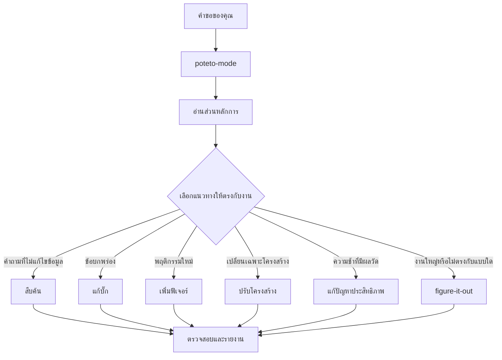

<a id="route-work-through-poteto-mode"></a>

# ส่งงานผ่าน `/poteto-mode`

`/poteto-mode` คือจุดเริ่มต้น คุณบอกเป้าหมาย ระบบจะเลือกหนึ่งในแนวทางทำงาน 23 แบบ (playbook) คัดลอกขั้นตอนลงในรายการงาน แล้วเรียกสกิลอื่นเมื่อขั้นตอนนั้นต้องใช้ หน้านี้อธิบายว่าคำสั่งที่ดีหน้าตาเป็นอย่างไร และจริง ๆ แล้วคุณต้องพิมพ์น้อยแค่ไหน


<a id="what-happens-to-your-prompt"></a>

## ระบบจัดการคำขอของคุณอย่างไร



แผนภาพแสดงเส้นทางที่พบบ่อย ยังมีแนวทางสำหรับปรับปรุงตัวชี้วัดทีละรอบ วิเคราะห์อาการขณะทำงานและข้อมูล trace ที่บันทึกไว้ สร้างต้นแบบ ทำ UI ให้ตรงกัน เขียนและประเมินสกิล ทำงานอัตโนมัติ ดูแล PR หรือชุด PR ให้พร้อม merge รวมชุด PR ที่ตรวจสอบแล้ว เดินคิว PR อัตโนมัติ ประสานงานระดับโปรเจกต์ รับช่วงเซสชัน พักงานอย่างปลอดภัย วางแผนหลายระยะ และล้าง worktree ดูทั้งหมดได้ที่ [ไดเรกทอรี playbook](../../skills/poteto-mode/playbooks/)

<a id="say-the-goal-not-the-ceremony"></a>

## บอกเป้าหมาย ไม่ต้องแจกแจงพิธีการ

คุณไม่ต้องเขียนข้อกำหนดยาว ๆ แค่บอกว่าอะไรผิดปกติหรือต้องการอะไร พร้อมข้อมูลที่รู้อยู่แล้วและช่วยประหยัดเวลาของเอเจนต์:

```text
/poteto-mode ผู้ใช้ได้รับการแจ้งเตือนสองครั้งหลังลองใหม่ ทำให้เกิดปัญหาซ้ำก่อน แล้วแก้และตรวจสอบ
```

นี่คือคำขอแบบ Bug fix คำว่า “ทำให้เกิดปัญหาซ้ำก่อน” เป็นข้อกำหนดจริง และแนวทางทำงานจะทำตาม ดูรายการงานที่เติมขั้นตอนแก้บั๊กเข้ามา ขั้นตอนที่ข้ามจะยังแสดงพร้อม `skip: <reason>`

เมื่อบทสนทนามีบริบทอยู่แล้ว คำขออาจสั้นมาก ตัวอย่างทั้งหมดนี้เพียงพอ:

```text
/poteto-mode ทำเลย
```

```text
ทำต่อ
```

```text
ทำต่อจนเสร็จ
```

คำสั่งสั้นใช้ได้เพราะโหมดทำงานต่อเนื่องและ playbook กำหนดโครงสร้างไว้ คำพูดของคุณบอกเจตนา ส่วนสกิลดูแลความรอบคอบ

<a id="switch-tasks-with-new-task"></a>

## เปลี่ยนงานด้วยคำว่า “new task”

แชตยาวจะสะสมบริบทจากงานก่อนหน้า ถ้าเปลี่ยนเรื่อง ให้บอกชัดเจน:

```text
/poteto-mode new task หาสาเหตุว่าทำไมรายการในแคชยังอยู่หลังออกจากระบบ ยังไม่ต้องแก้โค้ด
```

“new task” บอกให้ `/poteto-mode` เลือกแนวทางใหม่ แทนการทำตามแนวทางเดิมต่อ ส่วน “ยังไม่ต้องแก้โค้ด” กำหนดให้งานนี้เป็น Investigation หากไม่มีสองข้อความนี้ โหมดที่กำลังทำ Feature อาจมองคำถามของคุณเป็นขั้นตอนถัดไปของฟีเจอร์

<a id="give-parallel-work-its-own-worktree"></a>

## แยก worktree สำหรับงานที่ทำพร้อมกัน

ถ้าเอเจนต์หลายตัวทำงานบน repository เดียวกัน อาจแก้ไฟล์ทับกัน ขอให้แยกพื้นที่ตั้งแต่ต้น:

```text
/poteto-mode new task แตก branch จาก <base> ใน worktree ใหม่ แล้วนำการแก้ parser ไปทำที่นั่น
```

แยก branch และ worktree ต่อหนึ่งงานช่วยให้เอเจนต์ไม่ทับไฟล์กัน [แนวทางเปิด PR](../../skills/poteto-mode/playbooks/opening-a-pr.md) ใช้ worktree สำหรับงานแก้โค้ดอยู่แล้ว จึงมักต้องระบุเรื่องนี้เฉพาะเมื่อฐานหรือที่ตั้งมีความสำคัญ

worktree จะสะสมเพิ่มขึ้น เมื่อพื้นที่ใกล้เต็ม ให้ถาม:

```text
/poteto-mode อะไรกินพื้นที่ดิสก์อยู่? ลบ worktree ที่ตรวจแล้วว่าลบได้อย่างปลอดภัย
```

[แนวทางล้าง worktree](../../skills/poteto-mode/playbooks/worktree-cleanup.md) แยกประเภทแต่ละ worktree ตามสถานะ merge งานที่ยังไม่ commit และแชตที่ยังใช้งานอยู่ จะลบเฉพาะรายการที่หลักฐานยืนยันว่าปลอดภัย และรอให้คุณตัดสินใจสำหรับรายการที่มีงานยังไม่ commit

<a id="leave-it-running"></a>

## ปล่อยให้ทำงานต่อ

เมื่อคุณต้องไปทำอย่างอื่น ให้บอกว่าแบบไหนถือว่าเสร็จ แล้วปล่อยให้ทำต่อ:

```text
/poteto-mode ผมจะไปทำอย่างอื่น ทำต่อจนผลตรวจการย้ายระบบรายงานว่าไม่มีผู้เรียกแบบเก่าเหลืออยู่ บันทึกการตัดสินใจด้วย
```

งานที่คุณจะกลับมารีวิวภายหลังจะผ่าน [`/figure-it-out`](../../skills/figure-it-out/SKILL.md) ซึ่งออกแบบระยะการทำงานและเก็บบันทึกการตัดสินใจด้วย [`/show-me-your-work`](../../skills/show-me-your-work/SKILL.md) หน้า [ปล่อยให้ทำงานระหว่างที่คุณนอน](./07-overnight.md) อธิบายข้อตกลงทั้งหมด

**ข้อควรระวัง:** อย่าเรียงชื่อสกิลในคำขอ เช่น “ใช้ /how แล้ว /architect แล้ว /arena...” เพราะ playbook จัดลำดับไว้แล้ว การเรียงเองมักสลับหรือทำให้ตกขั้นตอนที่ควรมี ระบุชื่อสกิลเฉพาะเมื่ออยากเปลี่ยนตัวเลือกบางอย่าง

อ่านกฎเลือกเส้นทางทั้งหมดได้ใน [`poteto-mode`](../../skills/poteto-mode/SKILL.md)

ถัดไป: [ทำความเข้าใจโค้ด](./03-understand.md)
