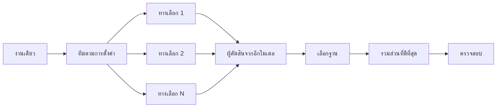

<a id="design-before-you-write-code"></a>

# ออกแบบก่อนเขียนโค้ด

การลองออกแบบยาก ๆ เพียงครั้งเดียวอาจทำให้ยึดติดกับรูปแบบแรกที่โมเดลนึกออก `/architect` ช่วยตกลงชนิดข้อมูลและขอบเขตก่อนลงมือ `/arena` ให้หลายเอเจนต์ลองจากโจทย์เดียวกันแล้วรวมส่วนที่ดีที่สุด `/interrogate` ให้โมเดลอื่นหาจุดที่ทำให้ผลลัพธ์พัง หากงานต้องการความครอบคลุมมากกว่ารวมแนวคิดการออกแบบ `/swarm` จะแบ่งงานหรือให้แข่งหลายทางแล้วรวบรวมผล


<a id="settle-the-shape-with-architect"></a>

## กำหนดรูปแบบให้ชัดด้วย `/architect`

```text
/architect ออกแบบกระบวนการ import ก่อนเขียนโค้ด ผมให้ความสำคัญที่สุดกับวิธีที่ผู้เรียกจะใช้งาน
```

[`/architect`](../../skills/architect/SKILL.md) เริ่มจากทำความเข้าใจพื้นฐาน เรียก `/how` กับโค้ดที่เกี่ยวข้อง และ `/why` เมื่อมีการย้ายความรับผิดชอบหรือชั้นของระบบ จากนั้นเรียก `/arena` ให้สร้างแบบร่างหลายทางเลือก โดยแต่ละแบบเขียนตัวอย่างการใช้งานของผู้เรียกก่อน ตามด้วยชนิดข้อมูล รูปแบบฟังก์ชัน และแผนผังโมดูล

ตามค่าเริ่มต้น จะนำแบบที่สังเคราะห์ได้ไปลงมือสร้างต่อทันที หากอยากดูแบบก่อน ให้บอก:

```text
/architect with checkpoint หยุดให้ผมดูแบบก่อนลงมือสร้าง
```

<a id="fan-out-attempts-with-arena"></a>

## ลองหลายแนวทางพร้อมกันด้วย `/arena`

```text
/arena ส่งคำขอของผมไปให้แต่ละทีมแบบตรงตามต้นฉบับ ผมอยากเทียบข้อเสนอของพวกเขากับของคุณ
```

[`/arena`](../../skills/arena/SKILL.md) เป็นเครื่องมือทั่วไปที่อยู่เบื้องหลัง ให้เอเจนต์ย่อย N ตัวลองออกแบบหรือเขียนโค้ดจากโจทย์เดียวกันพร้อมกัน แต่ละตัวใช้ worktree หรือไดเรกทอรีของตัวเอง ผู้ตัดสินแบบอ่านอย่างเดียวจะให้คะแนนตามเกณฑ์ โดยใช้โมเดลคนละตระกูลถ้าการตั้งค่ารองรับ ผู้ประสานงานอ่านผลงานทุกชิ้นตั้งแต่ต้นจนจบ เลือกหนึ่งชิ้นเป็นฐาน นำแนวคิดที่ดีที่สุดจากชิ้นอื่นมารวม แล้วตรวจสอบผล



ทีมมาจากการตั้งค่า [`/setup-pstack`](../../skills/setup-pstack/SKILL.md) และปรับเป็นรายงานได้ ขอทางเลือกมากขึ้นเมื่อการตัดสินใจสำคัญ หรือน้อยลงเมื่อไม่สำคัญมาก:

```text
/arena งานนี้ขอ 5 ทางเลือก รูปแบบ cache key จะมีต้นทุนสูงถ้าต้องเปลี่ยนทีหลัง
```

<a id="cover-slices-and-races-with-swarm"></a>

## ตรวจให้ครอบคลุมหรือแข่งหลายทางด้วย `/swarm`

```text
/swarm ตรวจทุก package ใต้ packages/ ด้วย check.sh ของแต่ละ package ใช้ผู้ทำงานหนึ่งตัวต่อ package แล้วสรุปรายงานเดียว
```

[`/swarm`](../../skills/swarm/SKILL.md) กระจายผู้ทำงาน N ตัวไปยังส่วนงานอิสระ ตารางความครอบคลุม ชุดตรวจหลายสาย พื้นที่สำรวจ หรือแนวทางแข่งขันที่กำหนดไว้ แต่ละตัวได้รับขอบเขตกับวิธีตรวจของตัวเอง แล้วรายงาน `PASS`, `ISSUES` หรือ `BLOCKED` เอเจนต์หลักรอทุกตัวและส่งรายงานสั้นชุดเดียว พร้อมระบุส่วนที่ตกหล่นหรืองานที่หยุดไป

ใช้เมื่อการทำพร้อมกันช่วยเพิ่มความครอบคลุมหรือเปิดให้วิธีตรวจอิสระแข่งกัน `/arena` ให้โจทย์ออกแบบหรือเขียนโค้ดเดียวกันแก่ทุกตัว แล้วเลือกฐานและรวมส่วนที่ดีที่สุด ส่วน `/swarm` แบ่งงานหรือแข่งตามกฎเลือกผู้ชนะที่ประกาศไว้ตั้งแต่ต้น ไม่ใช้กระบวนการเลือกฐานและรวมแบบของ `/arena`

<a id="break-it-with-interrogate"></a>

## หาจุดพังด้วย `/interrogate`

```text
/interrogate ตรวจทั้ง branch แบบตั้งข้อสงสัย ไม่ต้องจับผิดเรื่องเล็กน้อย เว้นแต่เป็นบั๊กจริงหรือทำให้พฤติกรรมเดิมเสีย
```

[`/interrogate`](../../skills/interrogate/SKILL.md) ส่ง diff เจตนา และเกณฑ์เดียวกันให้ผู้รีวิวหลายตัวจากโมเดลต่างตระกูล ความหลากหลายนี้สำคัญ เพราะแต่ละโมเดลมีจุดบอดต่างกัน ข้อค้นพบที่สองโมเดลพบแยกกันจึงน่าเชื่อถือสูง หัวหน้าจัดรายการเป็น `Act on` (ควรแก้), `Consider` (ควรพิจารณา), `Noted` (รับทราบ) และ `Dismissed` (ไม่รับข้อเสนอ) พร้อมเหตุผลสำหรับแต่ละรายการที่ไม่รับ และไม่แก้อะไรอัตโนมัติ

อ่านเหตุผลที่ไม่รับด้วย หัวหน้าเป็นวิศวกรอาวุโสที่ใช้วิจารณญาณ ไม่ได้รู้ถูกทุกเรื่อง คุณเปลี่ยนคำตัดสินได้

<a id="how-much-design-work-does-a-task-deserve"></a>

## งานหนึ่งควรใช้เวลาออกแบบแค่ไหน?

ทุกการเปลี่ยนแปลงต้องทำทั้งหมดนี้ไหม? ไม่จำเป็น ส่วนใหญ่ไม่ต้องใช้เลย ลองแบ่งระดับคร่าว ๆ:

- งานเล็กที่ทำเสร็จแล้วแต่ยังไม่มั่นใจ ใช้ `/interrogate` อย่างเดียว
- งานที่ข้ามขอบเขตฟังก์ชันหรือย้ายความรับผิดชอบ ควรใช้ `/architect` ซึ่งเรียก `/arena` มาด้วย
- การตัดสินใจเฉพาะเรื่องที่ลองหลายทางแล้วช่วยได้ เช่น ชื่อ รูปแบบ หรืออัลกอริทึม ใช้ `/arena` โดยตรง
- ตารางความครอบคลุม ชุดตรวจพร้อมกัน หรือการแข่งขันที่กำหนดแต่ละทางไว้ ใช้ `/swarm`
- แบบที่ยังมีข้อถกเถียงและเปลี่ยนกลับยาก ใช้ `/architect` แล้ว `/interrogate` ก่อนส่งงาน

`/poteto-mode` ใช้ระดับเหล่านี้อยู่แล้ว งานที่ข้ามขอบเขตจะเรียก `/architect` เอง คุณจึงมักเรียกสกิลเหล่านี้โดยตรงเมื่ออยากได้การตรวจมากหรือน้อยกว่าค่าเริ่มต้น

ถัดไป: [ลงมือสร้างและเก็บงานให้เรียบร้อย](./05-build-and-clean.md)
