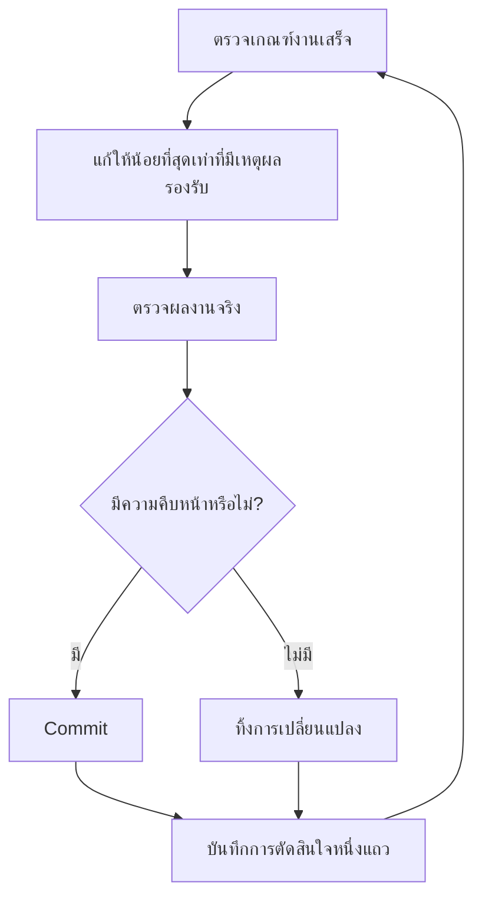

<a id="run-work-while-you-sleep"></a>

# ปล่อยให้ทำงานระหว่างที่คุณนอน

นี่คือผลตอบแทนจากทุกขั้นตอนที่ผ่านมา เอเจนต์ที่คุณเชื่อใจให้ตรวจงานของตัวเองได้ คือเอเจนต์ที่ฝากงานยากไว้ให้ทำตามลำพังได้ ความปลอดภัยมาจากเกณฑ์งานเสร็จที่ตรวจได้ worktree ที่แยกไว้ และบันทึกการตัดสินใจที่คุณตรวจตอนเช้า


<a id="the-overnight-contract"></a>

## ข้อตกลงสำหรับงานข้ามคืน

การส่งต่องานที่ดีมีเป้าหมาย เกณฑ์งานเสร็จ สิทธิ์ที่อนุญาต และทางออกเมื่อไปต่อไม่ได้ ไม่จำเป็นต้องยาว:

```text
/poteto-mode ผมจะนอนแล้ว ย้ายผู้เรียกทุกจุดไปใช้ parser ใหม่ ใน worktree ใหม่ที่แตกจาก <base>
งานเสร็จคือไม่มีผู้เรียกแบบเก่า ข้อมูลทดสอบ parser ผ่านทั้งหมด และลบ api เก่าแล้ว
เก็บบันทึกการตัดสินใจ ไม่ต้องถามก่อน commit
/loop จนเสร็จ ถ้าติดจริง ๆ หลังลองหลายชั่วโมง ให้หยุดและเขียนเหตุผล
```

แต่ละบรรทัดช่วยอะไรบ้าง:

- “ผมจะนอนแล้ว” เปลี่ยนวิธีทำงานของเซสชัน เอเจนต์จะหยุดถามและทำต่อ
- “งานเสร็จคือ...” เปลี่ยนเป้าหมายให้เป็นรายการที่ตรวจได้ทุกครั้งที่วนทำงาน
- “worktree ใหม่ที่แตกจาก `<base>`” ป้องกันงานชนกับสิ่งอื่นที่คุณเปิดอยู่
- “ไม่ต้องถามก่อน commit” ตอบเรื่องสิทธิ์ล่วงหน้า เพื่อไม่ให้เอเจนต์หยุดรอ
- `/loop` เป็นกลไกปลุกงานในตัวของ Cursor ไม่ใช่สกิล pstack [แนวทาง Autonomous run](../../skills/poteto-mode/playbooks/autonomous-run.md) ใช้เพื่อตรวจเกณฑ์งานเสร็จเมื่อมีเหตุการณ์หรือตามรอบเวลา
- ทางออกเมื่อไปต่อไม่ได้ช่วยให้หยุดที่ทางตันจริงและเขียนเหตุผล แทนการใช้แปดชั่วโมงตีความเป้าหมายใหม่ไปเรื่อย ๆ

เพราะคุณจะรีวิวงานหลังกลับมา `/poteto-mode` จึงส่งผ่าน [`/figure-it-out`](../../skills/figure-it-out/SKILL.md) เพื่อออกแบบระยะการทำงานก่อนเขียนโค้ด และจัดให้มีบันทึกการตัดสินใจ

<a id="what-the-loop-does-all-night"></a>

## วงรอบทำอะไรตลอดคืน



ทุกครั้งมีหนึ่งการแก้ หนึ่งการตรวจ และหนึ่งแถวบันทึก การแก้ที่ไม่ช่วยจะถูกทิ้ง เมื่อผลเริ่มนิ่งต้องเปลี่ยนแนวทาง ไม่ใช่หยุด และต้องไม่แอบลดเกณฑ์งานเสร็จเพื่อประกาศว่าสำเร็จ

<a id="the-morning-audit"></a>

## ตรวจงานตอนเช้า

[`/show-me-your-work`](../../skills/show-me-your-work/SKILL.md) ทำให้งานตรวจย้อนกลับได้ แต่ละแถวบันทึกเวลา ระยะงาน การตัดสินใจ เหตุผล ที่อยู่ของหลักฐาน และผลลัพธ์ เป็น TSV ที่ `decisions.tsv` หรือ `.audit/<task-slug>.tsv` เมื่อหลายงานใช้ไดเรกทอรีเดียวกัน ตามค่าเริ่มต้นจะเก็บไว้ในเครื่อง ควร commit เมื่อเป็นงานใหญ่ที่ผู้รีวิวต้องใช้ประวัตินี้เพื่อเชื่อผลลัพธ์

เมื่อกลับมา ขอผลในรูปแบบพร้อมรีวิว:

```text
/show-me-your-work สรุปให้ผมตามทันว่าคืนที่แล้วทำอะไรไปบ้าง
```

ก่อนส่งสรุป สกิลจะเรียกผู้รีวิวจากโมเดลต่างตระกูลมาอ่านบันทึกและบทสนทนา แล้วปิดท้ายคำตอบด้วยส่วน Attention ที่ระบุจุดควรตรวจเป็นพิเศษ อ่านส่วนนั้นก่อน แล้วดูแถวบันทึกที่อ้างถึง คุณกำลังตรวจการตัดสินใจ ไม่ต้องอ่านทั้งคืนใหม่

<a id="when-the-night-holds-a-queue-not-a-task"></a>

## เมื่อมีคิวงานข้ามคืน ไม่ใช่งานเดียว

ข้อตกลงข้างต้นพาหนึ่งงานไปถึงหนึ่งเกณฑ์งานเสร็จ บางคืนมีคิวการแก้ที่อิสระกันหรือทั้งโครงการ แนวทางสามแบบช่วยขยายวิธีทำงานนี้

[Autopilot-full](../../skills/poteto-mode/playbooks/autopilot-full.md) ทำคิว PR อิสระจน merge แต่ละ PR มีเอเจนต์เจ้าของหนึ่งตัวดูแลตั้งแต่สร้างจนรวมงาน และห้ามเจ้าของ merge ด้วยคำตัดสินของตนเอง ทีมผู้ตรวจใหม่จะเริ่มตรวจที่ commit ซึ่งเจ้าของระบุว่าโค้ดพร้อม และตรวจใหม่ทุกครั้งที่ push แล้ว patch เปลี่ยน อนุญาตให้ merge เฉพาะเมื่อ patch ที่จะรวมได้รับผลตรวจว่าผ่าน:

```text
/poteto-mode ใช้ full autopilot กับคิวนี้ แต่ละรายการเป็นอิสระ ผมอยากให้ merge ครบก่อนเช้า
```

[Autopilot-stack](../../skills/poteto-mode/playbooks/autopilot-stack.md) ใช้วงรอบเจ้าของงานแบบเดียวกัน แต่ไม่รวมงาน คุณจะตื่นมาพบชุด PR ที่ต่อเป็นเส้นเดียวจาก branch ฐาน พร้อมคำตัดสินของผู้ตรวจทุกจุด แล้วรีวิวและรวมเอง เลือกแบบนี้เมื่อการแก้สัมพันธ์กัน หรืออยากตรวจด้วยตาตัวเองก่อน merge:

```text
/poteto-mode ทำห้าการเปลี่ยนแปลงนี้แบบ autopilot แต่เรียงเป็นชุด PR ไม่ต้องรวม ผมจะรวมตอนเช้า
```

[Orchestrate](../../skills/poteto-mode/playbooks/orchestrate.md) เหมาะกับโครงการที่ยาวกว่าอายุงานของเอเจนต์ตัวเดียว: หลายวัน หลายชุด PR และเอเจนต์ย่อยจำนวนมากภายใต้แชตผู้ประสานงานหนึ่งตัว ผู้ประสานงานเขียนโจทย์ รวบรวมงานที่เอเจนต์ย่อยทำเสร็จ ดูแล PR ล่างสุดที่ยังไม่ merge ให้ผ่านการตรวจ และไม่เขียนโค้ดเอง เป็นเครื่องมือหนักโดยตั้งใจ หากเอเจนต์เดียวทำเสร็จในเซสชันได้ playbook จะส่งกลับไปใช้ข้อตกลงข้ามคืนด้านบน:

```text
/poteto-mode orchestrate การย้ายระบบจัดเก็บ ดูแลจนทุก package ย้ายเสร็จและ merge แล้ว ผมจะเข้ามาดูวันละสองครั้ง
```

**ข้อควรระวัง:** ระยะเวลาไม่ใช่เกณฑ์งานเสร็จ “ทำงานนี้ 4 ชั่วโมง” ไม่ให้สิ่งที่เอเจนต์ตรวจได้ คุณอาจตื่นมาพบแค่กิจกรรมสี่ชั่วโมงแทนผลลัพธ์ ให้ `/loop` มีเงื่อนไขที่ตัดสินได้ว่าผ่านหรือไม่ผ่าน

ถัดไป: [ชี้ทิศทางด้วยชื่อหลักการ](./08-principles.md)
